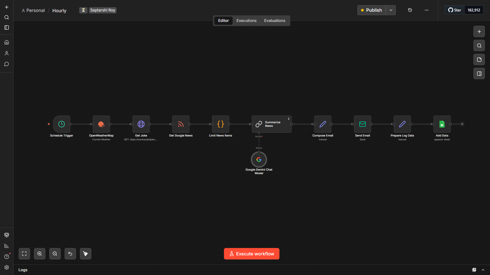

<h1 align="center">
  <b>⏳</b>
     
  <b>Hourly</b>
</h1>

  <a href="https://github.com/saptarshiroy39/Hourly"><b>Hourly</b></a> is an intelligent email digest system built with <a href="https://n8n.io"><b>n8n</b></a> that automatically compiles and delivers personalized hourly updates straight to your inbox. Stay informed with real-time weather, entertainment, and AI-curated news - all in one beautifully formatted email.

---

## ✨ Features

| FEATUREs                         | DESCRIPTION                                          | TECHNOLOGY                                    |
| -------------------------------- | ---------------------------------------------------- | --------------------------------------------- |
| 🌦️ **Real-time Weather Updates** | Current conditions, temperature, humidity, and more  | **_OpenWeatherMap API_**                      |
| 😂 **Hourly Humor**              | A fresh random joke to brighten your hour            | **_icanhazdadjoke API_**                      |
| 📰 **AI-Summarized Tech News**   | Top 10 technology headlines intelligently summarized | **_Google News RSS_**, **_Gemini 2.5 Flash_** |
| 📧 **Automated Email Delivery**  | Sends a beautifully formatted HTML email every hour  | **_Gmail SMTP_**                              |
| 📗 **Activity Logging**          | Tracks all digest activities with timestamps         | **_Google Sheets_**                           |

---

## 🤖 Workflow Overview

Here is a visual overview of the n8n workflow:

---

## ⚙️ Workflow Components

| #   | COMPONENTs           | DESCRIPTION                                        | NODEs                      |
| --- | -------------------- | -------------------------------------------------- | -------------------------- |
| 1️⃣  | **Schedule Trigger** | Runs every hour automatically                      | **_n8n Schedule Trigger_** |
| 2️⃣  | **OpenWeatherMap**   | Fetches current weather data for your location     | **_OpenWeatherMap API_**   |
| 3️⃣  | **Get Joke**         | Retrieves a random dad joke via HTTP request       | **_icanhazdadjoke API_**   |
| 4️⃣  | **Get Google News**  | Pulls latest tech news from Google News feed       | **_Google News RSS_**      |
| 5️⃣  | **Limit News Items** | Filters top 10 news articles                       | **_JavaScript Code_**      |
| 6️⃣  | **Summarize News**   | Uses Google Gemini to create an AI-powered summary | **_Google Gemini_**        |
| 7️⃣  | **Compose Email**    | Formats all data into a clean HTML email           | **_n8n Set Node_**         |
| 8️⃣  | **Send Email**       | Delivers the digest via Gmail SMTP                 | **_Gmail SMTP_**           |
| 9️⃣  | **Prepare Log Data** | Prepares activity log entry                        | **_n8n Set Node_**         |
| 🔟  | **Add Data**         | Logs the activity to Google Sheets                 | **_Google Sheets API_**    |

---

  Made with ⏳ by <a href="https://hirishi.in/">Saptarshi Roy</a>

